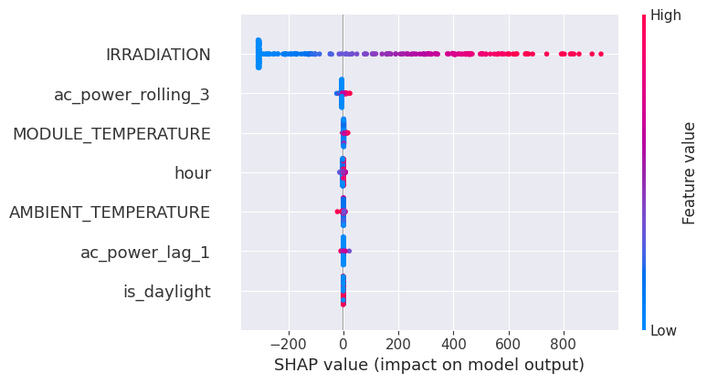
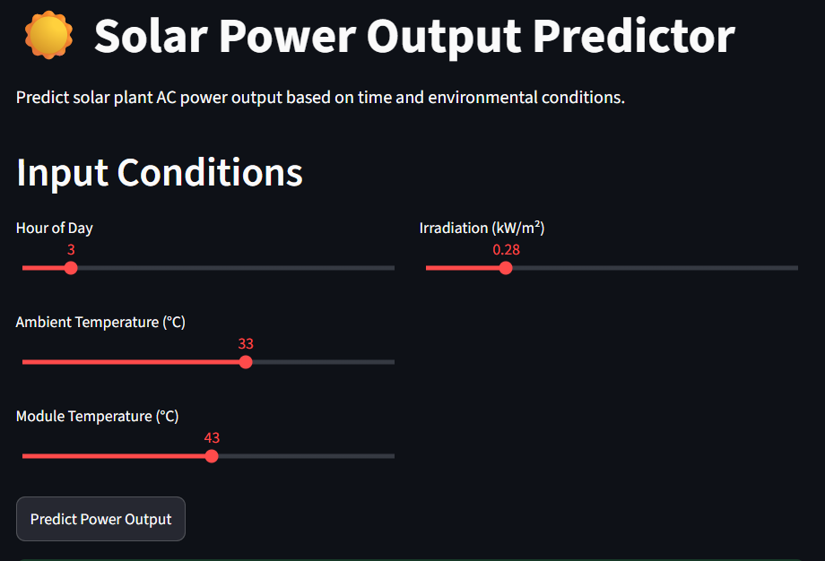
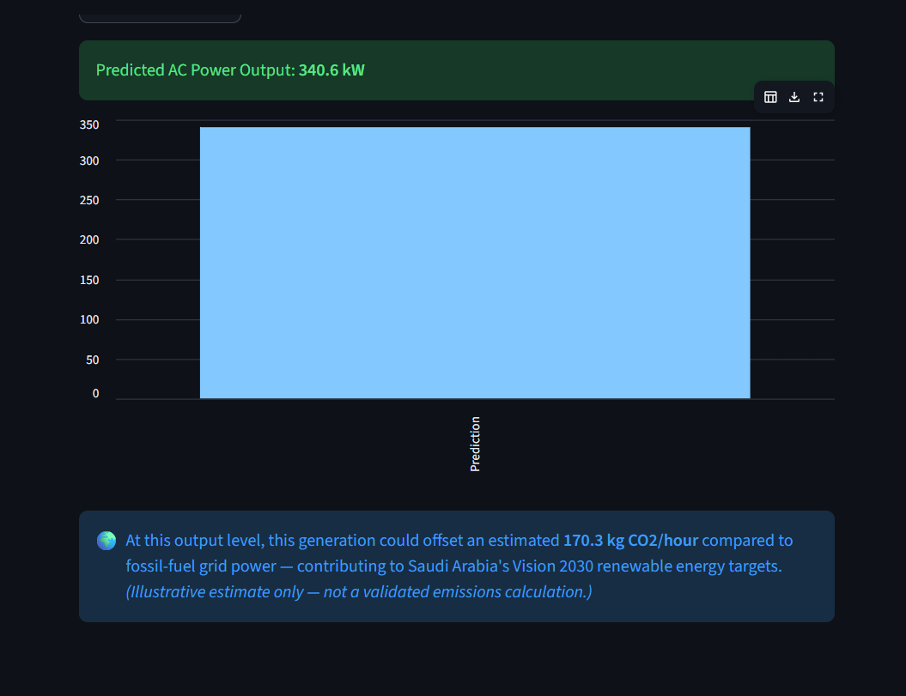

# Solar Power Output Forecasting — Saudi Vision 2030 Alignment

An end-to-end time series forecasting pipeline predicting solar plant AC 
power output, built to support Saudi Arabia's Vision 2030 National 
Renewable Energy Program and mega-projects like the Sudair Solar PV Plant.

## Problem Statement
Saudi Arabia's Vision 2030 targets 50% of the Kingdom's power mix from 
renewable sources, with solar as a central pillar (NEOM, Sudair, and other 
giga-scale solar plants). Accurate short-term solar output forecasting is 
critical for grid operators to balance intermittent renewable supply 
against demand — this project builds a forecasting pipeline for that use 
case using real solar plant sensor data.

## Dataset
- **Source:** Solar Power Generation Data (Kaggle, anikannal)
- **Size:** 68,778 generation readings + 3,182 weather readings, Plant 1, 
  aggregated to 3,155 clean unique timestamps
- **Features:** AC/DC Power, Daily Yield, Ambient Temperature, Module 
  Temperature, Irradiation
- **Link:** https://www.kaggle.com/datasets/anikannal/solar-power-generation-data

## Approach
1. Merged per-inverter generation data with plant-level weather sensor data
2. Aggregated across inverters to build a clean, single time series per plant
3. Feature engineering: time-based features, lag, and rolling averages
4. Compared Linear Regression, Random Forest, and XGBoost with chronological 
   (leakage-free) train/test splits
5. SHAP explainability on the best model
6. Deployed as a live Streamlit app with a Vision 2030 clean-energy impact estimate

## Key EDA Findings
- Solar output follows a clear daily bell curve — zero overnight, peaking 
  midday, consistent with expected physical behavior.
- Irradiation shows a near-perfect correlation with AC power output (0.99), 
  confirming it as the dominant physical driver of generation.
- Module temperature (0.95) and ambient temperature (0.72) show progressively 
  weaker correlation, consistent with their more indirect relationship to output.

## Models Compared
| Model              | RMSE   | MAE    |
|---------------------|--------|--------|
| Linear Regression    | 27.47  | 15.84  |
| Random Forest         | **21.22**  | **10.31**  |
| XGBoost                | 21.62  | 10.74  |

**Best model:** Random Forest. Notably, Linear Regression performs 
competitively here (unlike in noisier forecasting problems) because solar 
output is nearly linearly driven by irradiation — a genuine finding, not a 
limitation of the analysis. Random Forest still improves on this by 
capturing secondary non-linear effects (temperature saturation, sensor noise).

## Explainability (SHAP)
SHAP confirms irradiation as the overwhelmingly dominant feature, with a 
SHAP value range far exceeding all other inputs — the model has correctly 
learned the core physics of solar generation, with temperature, hour, and 
lag features playing only minor refinement roles.



## Live App




🔗 https://solar-power-forecasting-vision2030-iiqzkhpz6yiurvpzvjeb4m.streamlit.app/

## Real-World Impact — Vision 2030
This forecasting approach can support:
- **Grid balancing** — helping operators anticipate solar supply fluctuations
- **Storage planning** — informing battery dispatch decisions around predicted 
  generation dips
- **Giga-project monitoring** — scalable to large solar installations like 
  Sudair, supporting the Kingdom's renewable energy capacity targets

The live app includes an illustrative CO2-offset estimate, translating 
predicted output into avoided emissions versus fossil-fuel grid power — 
directly tying the model's predictions to Vision 2030's clean energy goals.

## How to Run Locally
```bash
git clone https://github.com/mohammedbasithqureshi/solar-power-forecasting-vision2030.git
cd solar-power-forecasting-vision2030
pip install -r requirements.txt
streamlit run app.py
```

## Tech Stack
Python, pandas, scikit-learn, XGBoost, SHAP, Streamlit, matplotlib, seaborn

## Author
Mohammed Basith Qureshi | linkedin.com/in/m-basith-qureshi | github.com/mohammedbasithqureshi